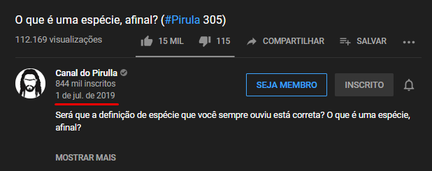

# Fix Youtube Date Bug

### About the bug and it's fixing.

There is a youtube bug which makes the date of the video does not show up.

Basically, if that happens to you, you can see the youtube video date by zooming out the page to 80% or 70%.
TeamYoutube pronunciated themselves saying they already fixed it on **9/26/19** (https://support.google.com/youtube/thread/13826560?hl=en) but it seems not to be true.

Here's an screenshot I took on **10/29/19:**

The date clearly does not show up.

When zoomed out to 80% the date appears:

A lot of people is relating the same problem (https://www.reddit.com/r/youtube/comments/d25pl1/bug_youtube_removed_upload_date/).
There is a simple way to fix it.

It's just needed to change where in the page the date shows up, which for this I made an Chrome Extension to do it automatically whenever some Youtube video page is loaded:

Zoomed out, same effect:

### How to Install Chrome Extensions

Official Google tutorial: https://support.google.com/chrome/a/answer/2714278?hl=pt-BR
